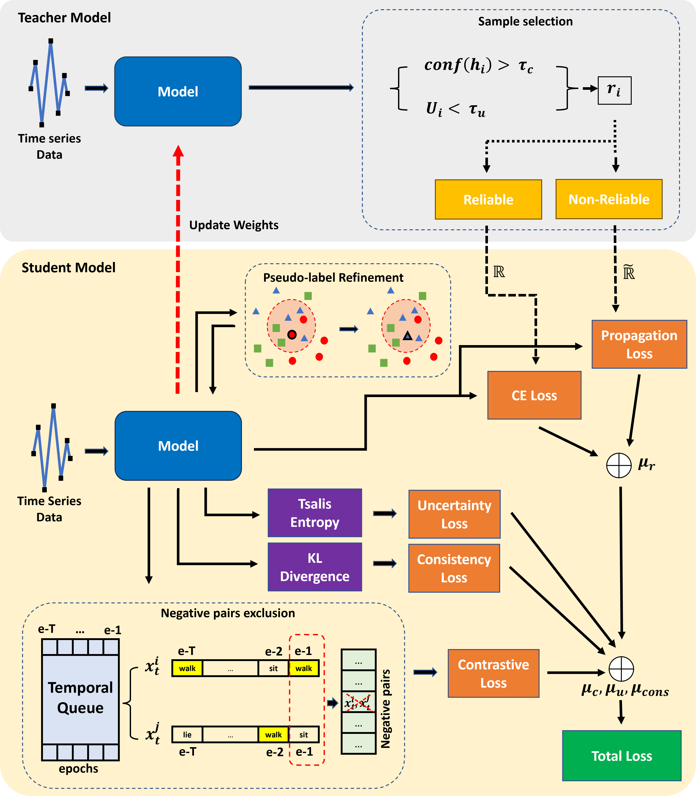

# TFDA
Time-Frequency Domain Adaptation (TFDA) approach addressing the absence of source-domain samples in the time-series unsupervised domain adaptation problems.

The code is based on the MAPU framework that taken from [github.com/mohamedr002/MAPU_SFDA_TS](https://github.com/mohamedr002/MAPU_SFDA_TS)

## Abstract

The issue of source-free time-series domain adaptations still gains scarce research attentions. On the other hand, existing approaches rely solely on time-domain features ignoring frequency components. This paper proposes Time Frequency Domain Adaptation (TFDA), a novel approach to address the absence of source-domain samples in the time-series unsupervised domain adaptation problems. TFDA is developed with a dual branch network structure fully utilizing both time and frequency features in delivering final predictions. It induces pseudo-labels based on a neighborhood concept where predictions of a sample group are aggregated to generate reliable pseudo labels. The concept of contrastive learning is carried out in both time and frequency domains with pseudo-label information and a negative pair exclusion strategy to make valid neighborhood assumptions. In addition, the time-frequency consistency technique is proposed using the self-distillation strategy while the uncertainty reduction strategy is implemented to alleviate uncertainties due to the domain shift problem. Last but not least, the curriculum learning strategy is integrated to combat noisy pseudo labels. Our experiments demonstrate the advantage of our approach over prior arts with noticeable margins in benchmark problems.

## Requirmenets:
- Python3
- Pytorch==1.7
- Numpy==1.20.1
- scikit-learn==0.24.1
- Pandas==1.2.4
- skorch==0.10.0
- openpyxl==3.0.7 (for classification reports)
- Wandb=0.12.7 (for sweeps)

## Datasets
### Download Datasets
We used three public datasets in this study. We also provide the preprocessed versions as follows:
- [SSC](https://researchdata.ntu.edu.sg/dataset.xhtml?persistentId=doi:10.21979/N9/UD1IM9)
- [UCIHAR](https://researchdata.ntu.edu.sg/dataset.xhtml?persistentId=doi:10.21979/N9/0SYHTZ)
- [MFD](https://researchdata.ntu.edu.sg/dataset.xhtml?persistentId=doi:10.21979/N9/PU85XN)

### Training Procedure
The experiments are organised in a hierarchical way such that:
- Several experiments are collected under one directory assigned by --experiment_description
- Each experiment could have different trials, each is specified by --run_description.

## Train model
- run python trainers/train.py   
