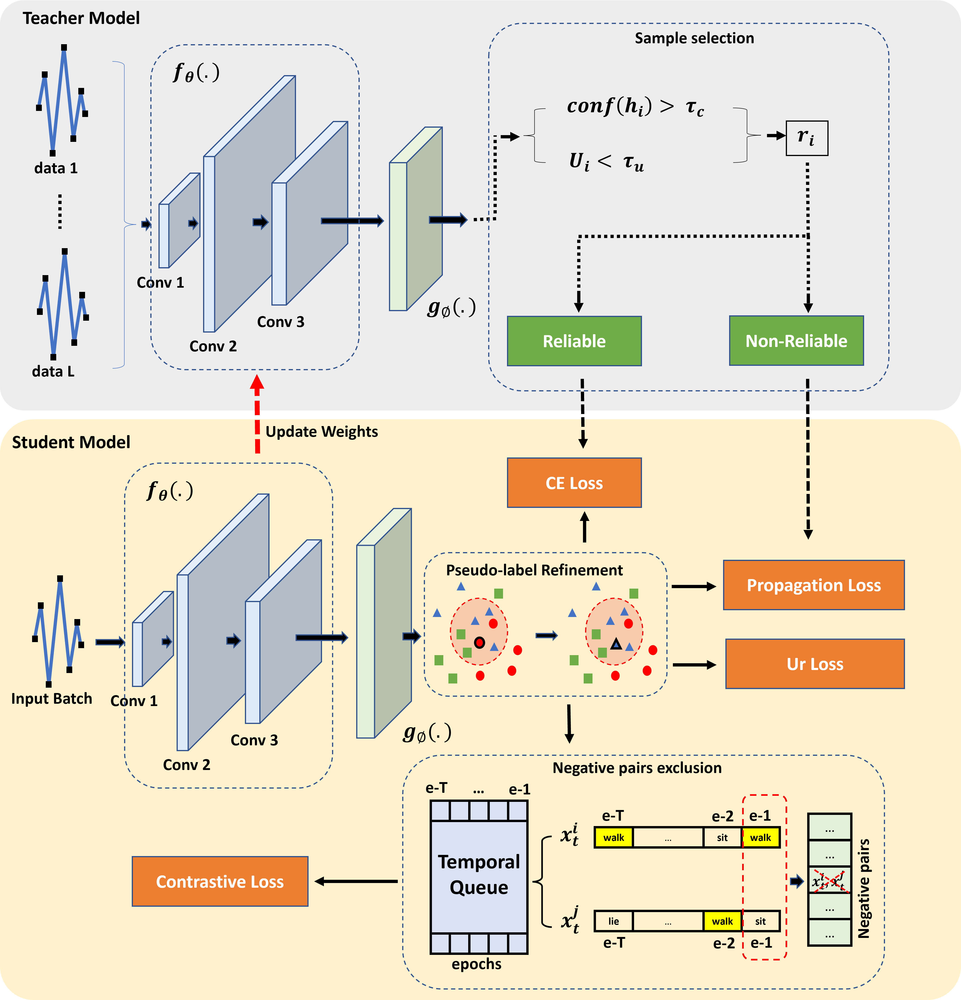

# SFTSDA
Source-Free Time-Series Domain Adaptation (SFTSDA) approach addressing the absence of source-domain samples in the time-series unsupervised domain adaptation problems.

The code is based on the MAPU framework that taken from [github.com/mohamedr002/MAPU_SFDA_TS](https://github.com/mohamedr002/MAPU_SFDA_TS)

## Abstract

The issue of source-free time-series domain adaptations still gains scarce research attentions. On the other hand, existing approaches ignore the issue of local neighborhood when pseudo-labelling and suffer from early memorization of noisy pseudo-labels. This paper proposes Source-Free Time-Series Domain Adaptation (SFTSDA) approach addressing the absence of source-domain samples in the time-series unsupervised domain adaptation problems. SFTSDA is developed from a neighborhood pseudo-labelling approach considering predictions of a sample group when producing pseudo-labels and is trained to minimize the contrastive loss such that the same class samples are close together while the different class samples are far apart. The uncertainty reduction strategy is implemented to alleviate prediction's uncertainties due to the domain shifts. Last but not least, the curriculum learning strategy and the mean teacher framework are devised to combat the problem of noisy pseudo-labels. Our experiments demonstrate the advantage of our approach over prior arts with noticeable margins in benchmark problems.

## Requirmenets:
- Python3
- Pytorch==1.7
- Numpy==1.20.1
- scikit-learn==0.24.1
- Pandas==1.2.4
- skorch==0.10.0
- openpyxl==3.0.7 (for classification reports)
- Wandb=0.12.7 (for sweeps)

## Datasets
### Download Datasets
We used four public datasets in this study. We also provide the preprocessed versions as follows:
- [SSC](https://researchdata.ntu.edu.sg/dataset.xhtml?persistentId=doi:10.21979/N9/UD1IM9)
- [UCIHAR](https://researchdata.ntu.edu.sg/dataset.xhtml?persistentId=doi:10.21979/N9/0SYHTZ)
- [MFD](https://researchdata.ntu.edu.sg/dataset.xhtml?persistentId=doi:10.21979/N9/PU85XN)

### Training Procedure
The experiments are organised in a hierarchical way such that:
- Several experiments are collected under one directory assigned by --experiment_description
- Each experiment could have different trials, each is specified by --run_description.

## Train model
- run python trainers/train.py   
